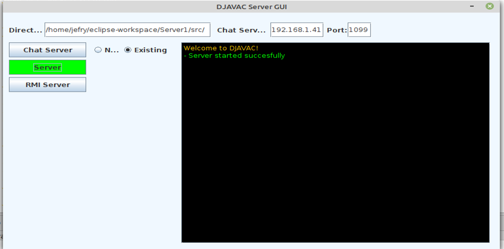
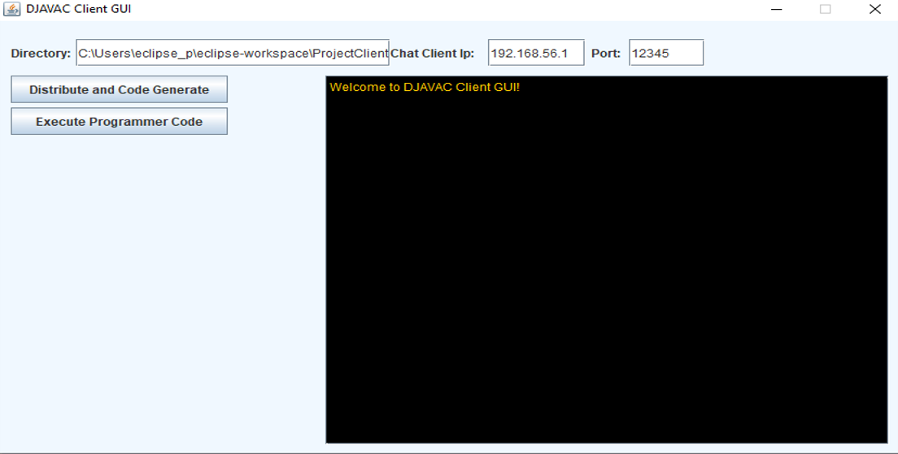

 

## Project: DJAVAC(Bachelor's Thesis)


## Visulation of the App

- 
- 


## Description
```bash
- The aim is providing to enable the Java programmer to write higher quality codes by spending less time.
- DJAVAC  is an automated loaded engine for java methods compilation over the network. 
- This engine is used when “distributed” denoted word on a selected method. 
- It is collected workload on the selected method and then distributed over TCP/IP network. 
- It can run on local network and internet.
- DJAVAC creates an opportunity to load the code and executes between server and clients for programmers.
```


## Technologies 💻
```bash
- Java
- RMI Server
```
